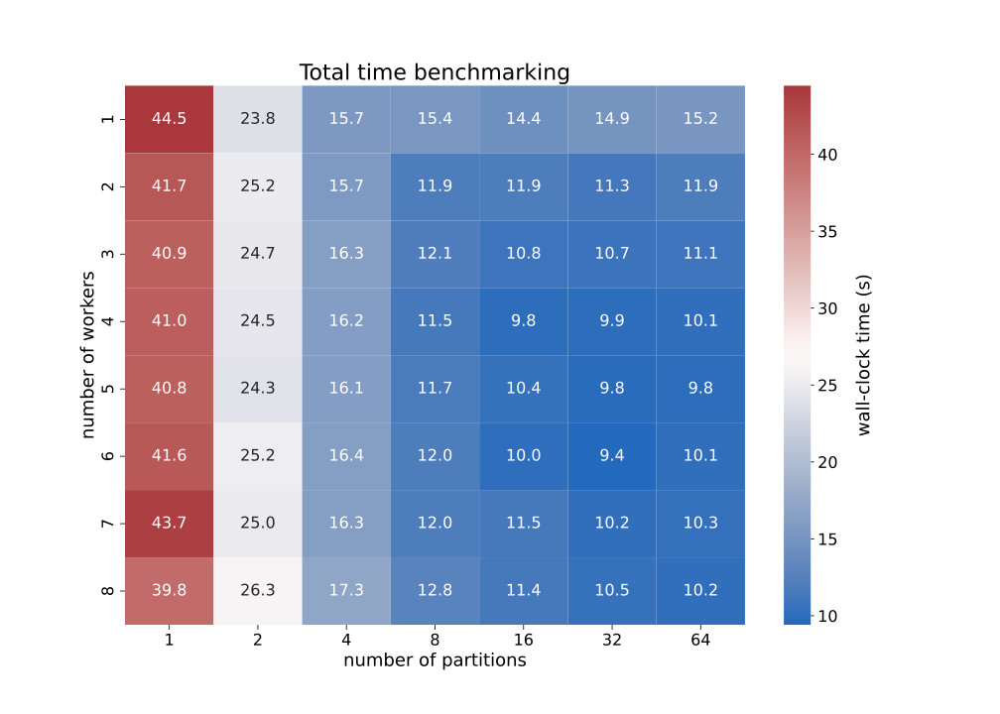

# Distributed processing of JUNO datasets 

[JUNO](http://juno.ihep.cas.cn/) is a neutrino experiment that aims to measure the energy of positrons released by neutrino interactions with high resolution.
The particular data structure suggests the use of ML image processing techniques.
In this context a distributed data preprocessing scheme is required, to deal with the huge datasets involved and the necessary construction of 2D images.  

This project exploits [Dask library](https://www.dask.org/) to achieve preprocessing distribution over 5 virtual machines.
The interplay between some hyperparameters such as the number of workers, the number of parttions, and the number of threads is investigated.

    

The file [``final-notebook.ipynb``](final-notebook.ipynb) contains a résumé of the work done.

---
## Authors

The project has been developed by 

- [Pietro Cappelli](https://github.com/PietroCappelli), M.Sc. Physics of Data, University of Padova
- [Alberto Coppi](https://github.com/c0pp1), M.Sc. Physics of Data, University of Padova
- [Lai Nicolò](https://github.com/niklai99), M.Sc. Physics of Data, University of Padova